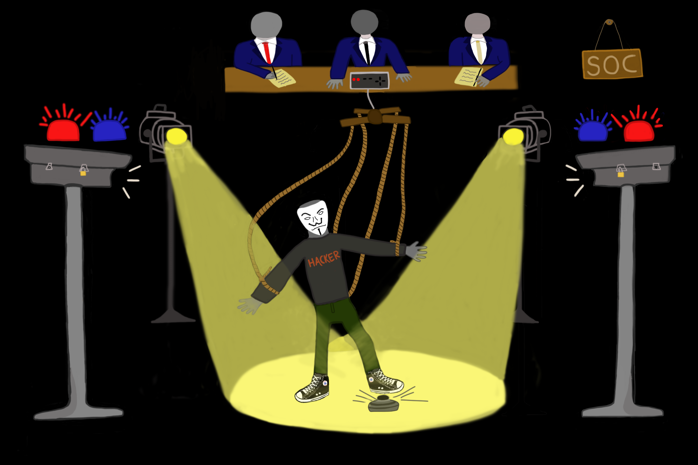
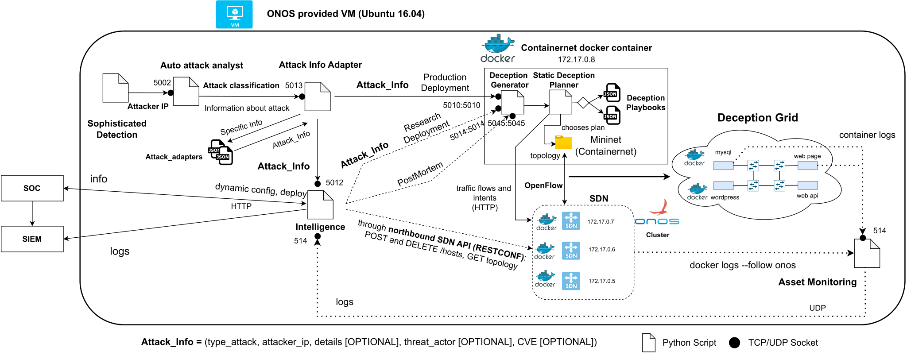

# Deceptive System

    

This cyber deception system was developed on the context a Master thesis for Computer Science and Engineering course at Instituto Superior de Engenharia de Lisboa (ISEL). The thesis' dissertation is entitled **"Proactive Cybersecurity tailoring through deception techniques"** and entails to address and investigate deception technology as a proactive approach to cyber defensive efforts.

In order to try to peak cyber deceptive capabilities for an organization, a system architecture was designed and a research implementation was performed. This implementation consists of a series of Python scripts that in conjunction with ONOS SDN, Contairnernet and Docker containers form the deceptive system that can deploy deception grids.

This implementation aims to validade the following architectural proposal:

- Base Architecture

    

- Extended Architecture

    

The validation and lab environment is summed below:

    

## Demonstration

